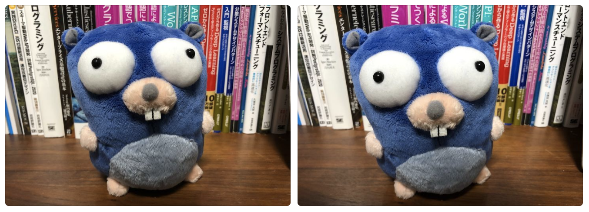

# simimgrs

[](https://circleci.com/gh/po3rin/simimgrs)

-----

in devlopment ...

## What is



Are these similar images ? yes !!
this crate checks for similar image using average hash algorism. The average of the luminance values ​​is calculated, and the 64-bit hash value is calculated as “1” for greater than the average and “0” for less than the average.

## Quick Start

```rust
use image;
extern crate simimgrs;

use std::env;

fn main() {
    let img1 = image::open("testdata/go1.jpg").unwrap();
    let img2 = image::open("testdata/go2.jpg").unwrap();

    let checker = simimgrs::SimilarChecker::new().threshold(10).compression_size(8, 8);

    println!("similar image: {}", checker.is_similar(img1, img2)) // true !
}
```

## Dependencies

https://github.com/image-rs/image
